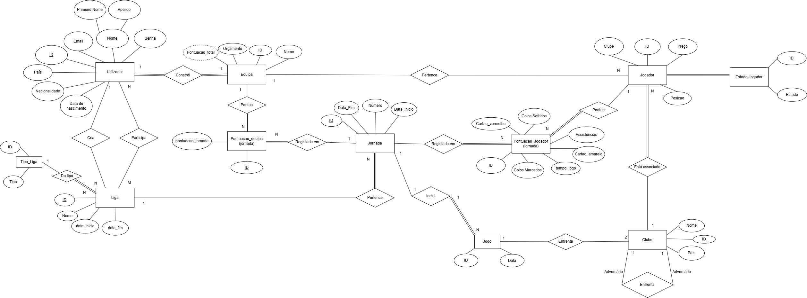
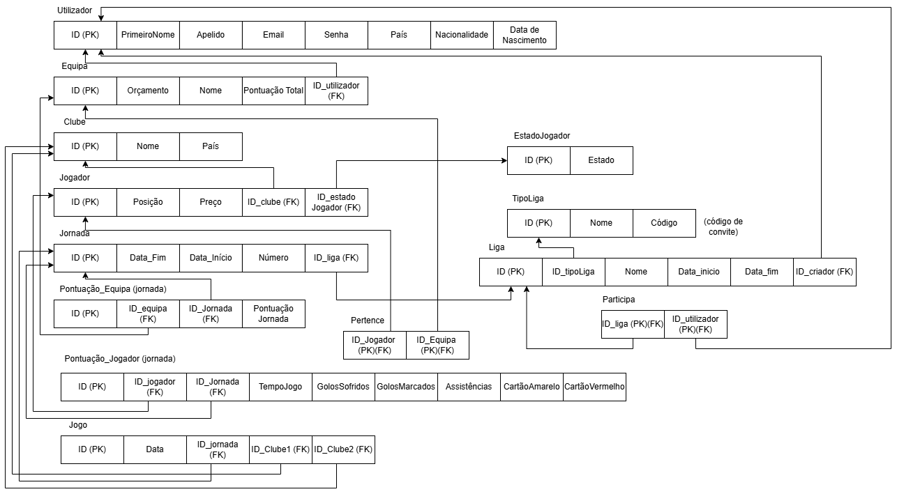

# BD: Trabalho Prático APFE

**Grupo**: P3G1
- Bernardo Mota Coelho, MEC: 125059
- Tiago Francisco Crespo do Vale, MEC: 125913

## Introdução / Introduction
 
Escreva uma pequena introdução sobre o trabalho.
Write a simple introduction about your project.

Com este projeto, pretendemos melhorar a experiência dos adeptos de futebol, proporcionando uma dinâmica interativa, divertida e competitiva de acompanhar o desempenho dos jogadores favoritos de cada utilizador. Tudo isto, através da criação de uma fantasy, a FantasyChamp.
A FantasyChamp é um sistema que permite a cada utilizador criar uma equipa virtual, composta por jogadores da realidade que participam nas equipas em competição na Liga dos Campeões (UEFA Champions League). 
A cada jornada,os jogadores acumulam pontos com base no seu desempenho de um jogo oficial.
Se um destes jogadores estiver na equipa do utilizador a equipa também ganha pontos. A soma das pontuações obtidas pelos jogadores numa jornada determina a pontuação da equipa nessa jornada, enquanto a soma de todas as jornadas corresponde à pontuação total da equipa ao longo da competição. Esta pontuação total define a classificação da Liga.

## ​Análise de Requi\sitos / Requirements

Requisitos Funcionais:

Utilizador ====

O sistema deve permitir o registo na plataforma;
O sistema deve permitir o login e logout;
O sistema deve permitir ao utilizador criar apenas uma equipa;
O sistema deve permitir ao utilizador editar o perfil (nome, país, nacionalidade e data de nascimento);

Gestão da Equipa ====

O sistema deve permitir ao utilizador escolher o nome da equipa;
O sistema deve permitir ao utilizador escolher os jogadores dentro do orçamento;
O sistema deve permitir substituir jogadores;
O sistema deve permitir calcular automaticamente a pontuação da equipa;
O sistema deve permitir ao utilizador ver a pontuação total da equipa e pontuação por jornada;
O sistema deve limitar a escolha de jogadores ao utilizador (11 titulares + 4 banco);

Gestão dos Jogadores ====

O sistema de permitir pesquisar os jogadores pela posição (Guarda-redes, Defesa, Médio, Avançado);
O sistema deve registar as estatsticas dos jogadores por jornada (Golos marcados, Golos sofridos, Assistências, Cartões, Tempo de Jogo);
O sistema deve calcular a pontuação de cada jogador por jornada;

Gestão Liga ====

O sistema deve permitir a criação de ligas privada, entrar em ligas privadas e entrar em ligas públicas;
O sistema deve gerar um código de convite para possibilitar a entrada de utilizadores em ligas privadas;
O sistema deve permitir a pesquisa de Ligas por código;
O sistema permite ao utilizador abandonar a Liga; - ???
O sistema permite ver as ligas em que o utilizador participa;
O sistema permite ver a classificação de todos os utilizador a participar na liga;

Pontuações Classificações ====

O sistema deve calcular automaticamente a pontuação dos jogadores na jornada;
O sistema deve calcular automaticamente a pontuação da equipa na jornada;
O sistema deve calcular automaticamente a pontuação total da equipa;

Jornadas/Jogos ====

O sistema deve registar Jogos automaticamente na Jornada correta;

Requisitos não Funcionais

Desempenho ====

O sistema deve permitir que os utilizadores utilizem a plataforma sem interrupções;
O sistema deve garantir que não ocorrem sobrecargas do servidor;
O sistema de ser fácil de usar e apresentar uma interface intuitiva;
O sistema deve conseguir carregar a página de classificação em <= 2 segundos para ligas até 100 equipas;
O sistema deve conseguir carregar páginas de pesquisa de ligas em <= 1 segundo para 10 ligas (por página);

Segurança ====

O sistema deve garantir integridade e consistência dos dados;
O sistema deve aceitar apenas palavras-passe fortes (min 8 caracteres, letras maiusculas e minusculas, simbolos e números);
O sistema deve terminar a sessão do utilizador após 1 hora de inatividade; - ???

Usabilidade e Acessibilidade ====

O sistema deve dispor de uma interface responsiva;
O sistema deve dispor de uma interface simples e clara;

## DER

## ER

