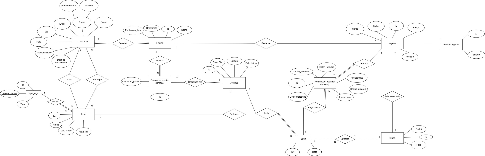

# BD: Trabalho Prático APF-T

**Grupo**: P3G1
- Bernardo Coelho, MEC: 125059
- Tiago Vale, MEC: 125913

## Introdução / Introduction
 
Com este projeto, pretendemos melhorar a experiência dos adeptos de futebol, proporcionando uma dinâmica interativa, divertida e competitiva de acompanhar o desempenho dos jogadores favoritos de cada utilizador. Tudo isto, através da criação de uma fantasy, a FantasyChamp.

A FantasyChamp é um sistema que permite a cada utilizador criar uma equipa virtual, composta por jogadores da realidade que participam nos clubes em competição na Liga dos Campeões (UEFA Champions League). 

A cada jornada,os jogadores acumulam pontos com base no seu desempenho de um jogo oficial.
Se um destes jogadores estiver na equipa do utilizador a equipa também ganha pontos. A soma das pontuações obtidas pelos jogadores numa jornada determina a pontuação da equipa nessa jornada, enquanto a soma de todas as jornadas corresponde à pontuação total da equipa ao longo da competição. Esta pontuação total define a classificação da Liga.

## ​Análise de Requisitos / Requirements

## DER - Diagrama Entidade Relacionamento/Entity Relationship Diagram

### Versão final/Final version

### Melhorias/Improvements 

Descreva sumariamente as melhorias sobre a entrega anterior.
Describe briefly the improvements made since the previous delivery.

## ER - Esquema Relacional/Relational Schema

### Versão final/Final Version

### Melhorias/Improvements

Descreva sumariamente as melhorias sobre a entrega anterior.
Describe briefly the improvements made since the previous delivery.

## ​SQL DDL - Data Definition Language

[SQL DDL File](sql/01_ddl.sql "SQLFileQuestion")
