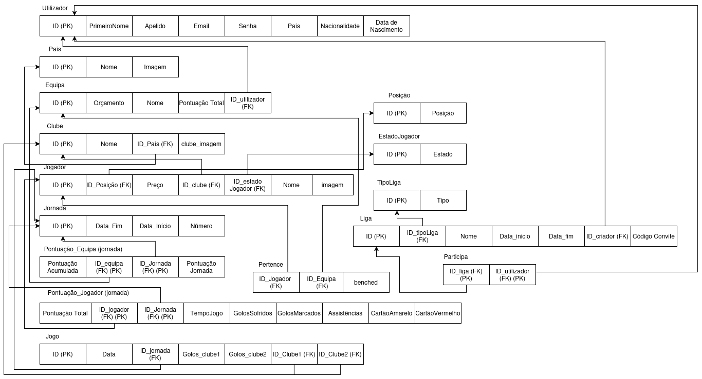
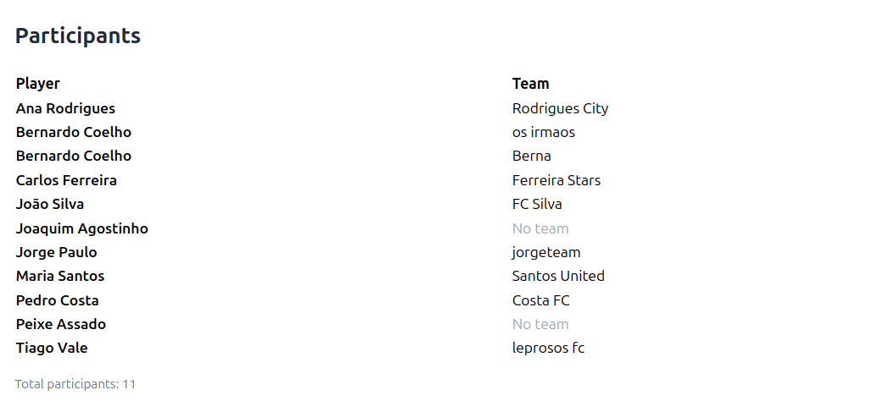
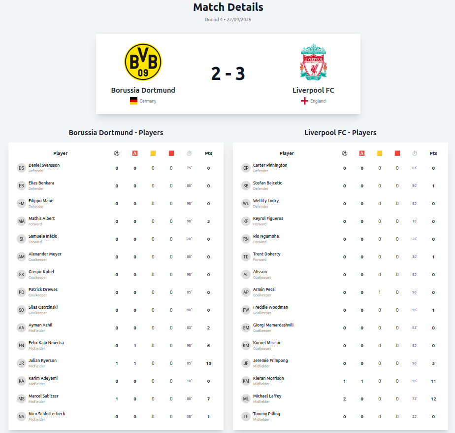

# BD: Trabalho Prático APF-T

**Grupo**: P3G1
- Bernardo Mota Coelho, MEC: 125059
- Tiago Francisco Crespo do Vale, MEC: 125913

# Instructions - TO REMOVE

Este template é flexível.
É sugerido seguir a estrutura, links de ficheiros e imagens, mas adicione conteúdo sempre que achar necessário.

---

This template is flexible.
It is suggested to follow the structure, file links and images but add more content where necessary.

The files should be organized with the following nomenclature:

- sql\01_ddl.sql: mandatory for DDL
- sql\02_sp_functions.sql: mandatory for Store Procedure, Functions,... 
- sql\03_triggers.sql: mandatory for triggers
- sql\04_db_init.sql: scripts to init the database (i.e. inserts etc.)
- sql\05_any_other_matter.sql: any other scripts.

Por favor remova esta secção antes de submeter.

Please remove this section before submitting.

## Introdução / Introduction
 
Escreva uma pequena introdução sobre o trabalho.
Write a simple introduction about your project.

## ​Análise de Requisitos / Requirements

## DER - Diagrama Entidade Relacionamento/Entity Relationship Diagram

### Versão final/Final version


### Melhorias/Improvements 

- Na relação **Pertence** entre Equipa e Jogador, verificamos a necessidade de acrescentar um atributo binário benched, para averiguar se um jogador da equipa de um determinado utilizador estaria no banco ou não;
- Decidimos criar uma nova entidade **Posição**, para assim como no **Estado Jogador** obtermos uma "lista" de posições que um jogador pode tomar;
- A criação de uma entidade **País**, relacionada com o **Clube** para indicar-mos a que país um determinado clube pertence;
- Adicionamos novos atributos à entidade **Jogo** (Golos_club1, Golos_club2) para determinação da quantidade de golos de cada uma das equipas que se encararam;
- Adição do atributo Pontuação_Total à relação **Pontuacao_Jogador** para tornar possivel a soma da pontuação de um determinado jogador ao longo de várias jornadas;
- A adição do atributo pontuacao_acumulada à entidade de **Pontuacao_Equipa** também para tornar possivel a soma da pontuação de uma determinada equipa ao longo de várias jornadas;
- A alteração da localização do atributo Código_convite de uma Liga, agora em vez de pertencer à entidade **Tipo_Liga** passará a pertencer à entidade **Liga** para simplificação de dados;
- A adição de atributos de imagem às entidades de **Clube** e **Jogador** para tornar a front-end do projeto mais intuitiva, e melhorar a experiência visual do utilizador.

## ER - Esquema Relacional/Relational Schema

### Versão final/Final Version



### Melhorias/Improvements

- Criação da tabela **País** que tem como Primary Key um ID único e como atributos a sua imagem e um Nome;
- Adicionamos uma Foreign Key à relação **Clube** no atributo ID_País que referência o ID da nova relação **País**;
- Adição do atributo Pontuação Acumulada a **Pontuação_Equipa (jornada)** e Pontuação Total a **Pontuação_Jogador (jornada)**, respetivamente, como esclarecido anteriormente;
- Remoção total da relação de **Enfrenta** devido ao facto do seu uso ser nulo e ser pouco redundante uma vez que a relação **Jogo** já tinha todos os atributos necessários para o objetivo final;
- Adição de atributos à relação de **Jogo** Golos_clube1 e Golos_clube2 assim como as Foreign Keys ID_Clube1 e ID_Clube2 que ambas referênciam o ID da relação **Jogador**;
- Adição do atributo "benched" a **Pertence**, como esclarecido anteriormente;
- Código de convite movido de **TipoLiga** para **Liga** como esclarecido anteriormente;
- Criação de uma relação **Posição** que contém um ID único, assim como as posições possíveis que um jogador pode tomar, desta forma, criámos, também, uma Foreign Key em ID_Posição na relação **Jogador** que referência o ID da nova relação;
- Criação de atributos imagem para as relações **Clube** e **Jogador**, (esclarecido anteriormente).

## ​SQL DDL - Data Definition Language

[SQL DDL File](sql/01_ddl.sql "SQLFileQuestion")

## SQL DML - Data Manipulation Language

### Formulario exemplo/Example Form



```sql
-- Mostrar todos os utilizadores participantes de uma liga específica
SELECT 
    P.ID_Liga,
    L.Nome AS Liga_Nome,
    L.ID_tipoLiga,
    TL.Tipo AS Tipo_Liga,
    P.ID_Utilizador,
    U.PrimeiroNome + ' ' + U.Apelido AS Nome_Completo,
    U.Email,
    U.País,
    E.ID AS Equipa_ID,
    E.Nome AS Equipa_Nome,
    E.PontuaçãoTotal AS Pontuacao
FROM FantasyChamp.Participa P
INNER JOIN FantasyChamp.Liga L ON P.ID_Liga = L.ID
INNER JOIN FantasyChamp.Tipo_Liga TL ON L.ID_tipoLiga = TL.ID
INNER JOIN FantasyChamp.Utilizador U ON P.ID_Utilizador = U.ID
LEFT JOIN FantasyChamp.Equipa E ON U.ID = E.ID_utilizador
WHERE P.ID_Liga = '31A96EAE-509D-4E0E-BDE2-6113DF5B3809' -- Liga Mundial
ORDER BY E.PontuaçãoTotal DESC, U.PrimeiroNome;

-- OU usar a view ParticipantesLiga

SELECT 
    ID_Liga,
    nome AS Nome_Completo,
    equipa AS Equipa_Nome,
    id_equipa,
    id_utilizador
FROM FantasyChamp.ParticipantesLiga
WHERE ID_Liga = '31A96EAE-509D-4E0E-BDE2-6113DF5B3809' -- Liga Mundial
ORDER BY equipa;

-- Adicionar utilizador a uma liga
INSERT INTO FantasyChamp.Participa (ID_Utilizador, ID_Liga)
VALUES (
    '00000000-0000-0000-0000-000000000001', -- Place-Holder de utilizador para adicionar
    '31A96EAE-509D-4E0E-BDE2-6113DF5B3809'  -- Liga Mundial
);

-- Adicionar utilizador a uma liga privada (com validação de código)
DECLARE @Resultado BIT;
EXEC FantasyChamp.JuntarLiga
    @ID_Utilizador = '00000000-0000-0000-0000-000000000001', -- Place-Holder de utilizador para adicionar
    @ID_Liga = '31A96EAE-509D-4E0E-BDE2-6113DF5B3809',
    @Codigo = 'ABC123', -- Exemplo de código
    @Resultado = @Resultado OUTPUT;
SELECT @Resultado AS Sucesso;
```

```sql
-- Obter detalhes do Jogador a usar a view PlayerDetails
SELECT 
    ID,
    Jogador_Nome AS Nome,
    Posicao,
    Preço,
    jogador_imagem,
    Clube_Nome AS Clube,
    clube_imagem,
    ID_clube AS Clube_id,
    Estado
FROM FantasyChamp.PlayerDetails
WHERE ID = 250453 -- Jogador da imagem

-- Inserir dados
INSERT INTO FantasyChamp.Jogador(ID, Nome, ID_Posição, Preço, ID_clube, ID_Estado_Jogador, jogador_imagem)
VALUES (1, 'Vitor', 'POS01', 10.4, 19, 'STT01', 'imagem.png'); -- Jogador fictício
```


```sql
-- Obter detalhes do Clube a usar a view ClubDetails
SELECT ID,
    Nome,
    Pais_Nome,
    Pais_Imagem,
    clube_imagem
FROM FantasyChamp.ClubDetails
WHERE ID = 57 -- Clube da imagem

-- Obter jogadores que jogam no clube
SELECT J.ID,
    J.Nome,
    P.Posição AS Posicao,
    J.Preço,
    J.jogador_imagem
FROM FantasyChamp.Jogador J
JOIN FantasyChamp.Posição P ON J.ID_Posição = P.ID
WHERE J.ID_clube = 57
ORDER BY J.Nome

-- Inserir dados
INSERT INTO FantasyChamp.Clube(ID, Nome, ID_País, clube_imagem)
VALUES (12, 'Andorinhas', 'AFG', 'imagem.png'); -- Clube Fictício
```


```sql
-- Obter informações do jogo a usar a view JogoDetalhesCompleto
SELECT * FROM FantasyChamp.JogoDetalhesCompleto
    WHERE ID = 81445A6E-D36D-421D-A0CB-2E29A85219EE -- ID do Jogo na imagem

-- Obter estatísticas do jogador, a usar a view EstatisticasJogadoresJornada
SELECT * FROM FantasyChamp.EstatisticasJogadoresJornada
    WHERE ID_jornada = 4 -- Jornada do Jogo da imagem
        AND Clube_ID IN (4, 64) -- Ids dos clubes do Jogo da imagem
        AND TempoJogo > 0
    ORDER BY Clube_ID, Posicao, Nome

-- Inserir dados
INSERT INTO FantasyChamp.Jogo(ID, Data, ID_Clube1, ID_Clube2, ID_jornada, golos_clube1, golos_clube2)
VALUES (00000000-0000-0000-0000-000000000001, 2024-12-12, 5,6,'JOO01',2,3) -- clubes ficticios de um jogo ficticio
```

## Normalização/Normalization

Descreva os passos utilizados para minimizar a duplicação de dados / redução de espaço.
Justifique as opções tomadas.
Describe the steps used to minimize data duplication / space reduction.
Justify the choices made.

## Índices/Indexes

##### 1. Chaves Estrangeiras
- IX_Clube_ID_Pais: Índice non-clustered na coluna **ID_País** da relação **Clube**, usado para otimizar a busca de clubes por país;
- IX_Jogador_ID_clube: Índice non-clustered na coluna ID_clube da relação **Jogador**, melhorando a performance das consultas que filtram jogadores por clube;
- IX_Jogador_ID_Posicao: Índice non-clustered na coluna ID_Posição da relação **Jogador**, utilizado para buscas eficientes de jogadores por posição;  
- IX_Jogador_ID_Estado: Índice non-clustered na coluna ID_Estado_Jogador da relação **Jogador**, utilizado para buscas eficientes de jogadores por posição;
- IX_Jogo_ID_Clube1: Índice non-clustered na coluna ID_Clube1 da relação **Jogo**, para melhorar a consulta de jogos por clube1;
- IX_Jogo_ID_Clube2: Índice non-clustered na coluna ID_Clube2 da relação **Jogo**, para melhorar a consulta de jogos por clube2;
- IX_Jogo_ID_jornada: Índice non-clustered na coluna ID_jornada da tabela **Jogo**, usado para buscas de jogos por clube2;
- IX_Equipa_ID_utilizador: Índice non-clustered na coluna ID_utilizador da tabela **Equipa**, otimizando as buscas por utilizador em equipas;
- IX_Liga_ID_tipoLiga: Índice non-clustered na coluna ID_tipoLiga da tabela **Liga**, para melhorar a performance de consultas por tipo de liga;
- IX_Liga_ID_criador: Índice non-clustered na coluna ID_criador da relação **Liga**, utilizado para pesquisas sobre ligas criadas por utilizadores específicps.

##### 2. Join Tables 
- IX_Participa_ID_Liga: Índice non_clustered na coluna ID_Liga da relação **Participa**, utilizado para otimizar buscas sobre a participação em ligas;
- IX_Pertence_ID_Equipa: Índice non_clustered na coluna ID_Equipa da relação **Pertence**, facilitando as consultas sobrea a equipa à qual um determinado jogador pertence.

##### 3. Filstros em Stored Procedures e Views
- IX_Pertence_benched: Índice non_clustered na tabela **Pertence**, a usar as colunas ID_Equipa e benched. Inclui a coluna ID_Jogador, a otimizar filtros que envolvem a condição de estar "benched" (no banco de reservas).

##### 4. Índices para DATES em filtros de jogos
- IX_Jornada_Datas: Índice non_clustered nas colunas Data_Inicio e Data_Fim da relação **Jornada**, incluindo a coluna Numero, otimizado para consultas que envolvem datas de inicio e fim das jornadas;
- IX_Jogo_Data: Índice non_clustered na coluna Data da relação **Jogo** com inclusão das colunas ID_Clube1 e ID_Clube2, permitindo buscas ráidas por data dos Jogos.
- IX_Liga_Datas: Índice non_clustered nas colunas Data_Fim e ID_tipoLiga da relação **Liga**, incluindo as colunas Nome e ID_criador, usado para otimizar consultas que envolvem datas de fim das ligas.

##### 5. Índices para queries pesadas (pontuações)
- IX_Pontuacao_Jogador_Lookup: Índice non_clustered nas colunas ID_jornada e ID_jogador da relação Pontuação_Jogador, inlcuindo as colunas pontuação_total, GolosMarcados e Assistencias, para otimizar consultas sobre as pontuações dos jogadores.
- IX_Pontuacao_Equipa_Lookup: Índice non_clustered nas colunas ID_jornada e ID_Equipa da tabela Pontuação_Equipa, incuindo as colunas pontuação_jornada e pontuação_acumulada, melhorando, assim, a performance de consultas sobre a pontuação das equipas.

```sql
-- 1. Foreign keys
CREATE NONCLUSTERED INDEX IX_Clube_ID_Pais ON FantasyChamp.Clube(ID_País);
CREATE NONCLUSTERED INDEX IX_Jogador_ID_clube ON FantasyChamp.Jogador(ID_clube);
CREATE NONCLUSTERED INDEX IX_Jogador_ID_Posicao ON FantasyChamp.Jogador(ID_Posição);
CREATE NONCLUSTERED INDEX IX_Jogador_ID_Estado ON FantasyChamp.Jogador(ID_Estado_Jogador);

CREATE NONCLUSTERED INDEX IX_Jogo_ID_Clube1 ON FantasyChamp.Jogo(ID_Clube1);
CREATE NONCLUSTERED INDEX IX_Jogo_ID_Clube2 ON FantasyChamp.Jogo(ID_Clube2);
CREATE NONCLUSTERED INDEX IX_Jogo_ID_jornada ON FantasyChamp.Jogo(ID_jornada);


CREATE NONCLUSTERED INDEX IX_Equipa_ID_utilizador ON FantasyChamp.Equipa(ID_utilizador);

CREATE NONCLUSTERED INDEX IX_Liga_ID_tipoLiga ON FantasyChamp.Liga(ID_tipoLiga);
CREATE NONCLUSTERED INDEX IX_Liga_ID_criador ON FantasyChamp.Liga(ID_criador);

-- 2. Join tables
CREATE NONCLUSTERED INDEX IX_Participa_ID_Liga ON FantasyChamp.Participa(ID_Liga);
CREATE NONCLUSTERED INDEX IX_Pertence_ID_Equipa ON FantasyChamp.Pertence(ID_Equipa);

-- 3. Filtros nas SPs e Views
CREATE NONCLUSTERED INDEX IX_Pertence_benched 
    ON FantasyChamp.Pertence(ID_Equipa, benched) 
    INCLUDE (ID_Jogador);

-- 4. Nas datas para filtros de jogos
CREATE NONCLUSTERED INDEX IX_Jornada_Datas 
    ON FantasyChamp.Jornada(Data_Inicio, Data_Fim) 
    INCLUDE (Numero);

CREATE NONCLUSTERED INDEX IX_Jogo_Data 
    ON FantasyChamp.Jogo(Data) 
    INCLUDE (ID_Clube1, ID_Clube2);

CREATE NONCLUSTERED INDEX IX_Liga_Datas 
    ON FantasyChamp.Liga(Data_Fim, ID_tipoLiga) 
    INCLUDE (Nome, ID_criador);

-- 5. Pontuações, para queries pesadas
CREATE NONCLUSTERED INDEX IX_Pontuacao_Jogador_Lookup 
    ON FantasyChamp.Pontuação_Jogador(ID_jornada, ID_jogador) 
    INCLUDE (pontuação_total, GolosMarcados, Assistencias);

CREATE NONCLUSTERED INDEX IX_Pontuacao_Equipa_Lookup 
    ON FantasyChamp.Pontuação_Equipa(ID_jornada, ID_Equipa) 
    INCLUDE (pontuação_jornada, pontuação_acumulada);
```

## SQL Programming: Stored Procedures, Triggers, UDF e Views

[SQL SPs and Functions File](sql/02_sp_functions.sql "SQLFileQuestion")

[SQL Triggers File](sql/03_triggers.sql "SQLFileQuestion")

[SQL View File](sql/05_views.sql "SQLFileQuestion")

## Outras notas/Other notes

### Dados iniciais da dabase de dados/Database init data

[SQL DB Init File](sql/04_db_init.sql "SQLFileQuestion")

### Apresentação

[Slides](slides.pdf "Sildes")

[Video](https://elearning.ua.pt/pluginfile.php/55992/mod_label/intro/VideoTrabalho2013.mp4)


 